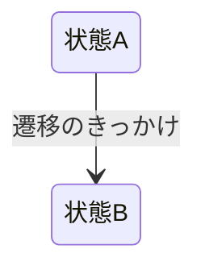

# ドメイン: {{機能名}}

<!--
この文書の役割：この機能が「どう動くか」を、実装方法に触れずに正確に定義する。

■ 書いてはいけないもの（docs/RULES.md §2 が正）
  製品名・サービス名 / ライブラリ名 / テーブル名・カラム名・SQL /
  API のパスやメソッド / 「キャッシュする」「バッチで回す」等の実現方式 /
  コンポーネント名・画面レイアウト

■ 判定テスト
  この文書から技術用語をすべて消したとき、意味が通じるか？
  通じないなら、それは adr/ に書くべき内容。

ファイル名は機能名の英語スラッグ（例: plan-lifecycle.md）。
新規作成したら docs/README.md の構成ツリーと「一次情報の所在」表も更新する。
-->

{{この機能が何を扱うか、1〜2 行}}

## 状態 [提案]

<!-- 状態を持つ機能なら定義する。持たないなら節ごと削除してよい。 -->

| 状態 | 条件 | 説明 |
|---|---|---|
| | | |

## 状態遷移図

## 遷移ルールの詳細

### {{操作・イベント名}} [提案]

- 前提条件：
- 起きること：
- 起きないこと： <!-- 「◯◯はしない」と明示すると、AI が気を利かせて余計な処理を足すのを防げる -->

## 用語の区別

<!--
混同しやすい似た概念があれば、ここで明文化する（例: 「予定日」と「期限」と「完了日」の違い）。
実装バグの多くはここの曖昧さから生まれる。
-->

| 用語 | 意味 | 何に使うか |
|---|---|---|
| | | |

## 境界・例外ケース [提案]

<!-- 同時実行、空データ、上限値、時刻をまたぐ場合など。「許容する」も決定として書く。 -->

-

## 他機能との関係

<!-- この機能の変更が波及する先。リンクで示す。 -->

- `domain/{{他の機能}}.md` …
- `adr/XXXX` …

## 未確定 [保留]

<!-- 決まっていないことをここに書いたら、open-questions.md にも登録する。 -->

-
