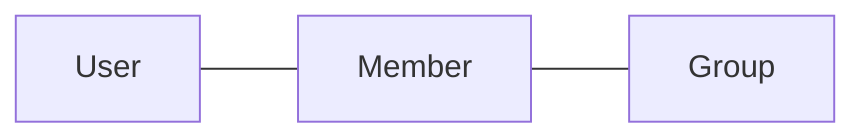
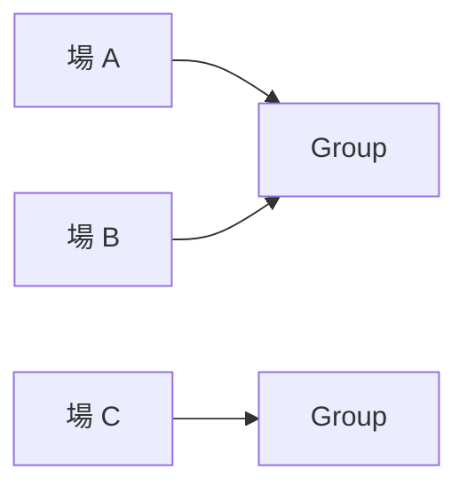
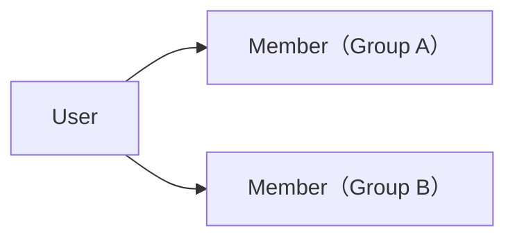

# ドメイン: グループとメンバー

グループ（お金の動きを一緒に管理する単位）と、メンバー（ある User の、ある Group における立場）を扱う。

## 概念

- `User` … mmkn を利用する人そのもの。グループをまたいで同一
- `Group` … お金の動きを管理する単位
- `Member` … ある User の、ある Group における立場

### User の属性 [確定]

| 属性 | 説明 |
|---|---|
| 同一性 | グループをまたいで変わらない、その人を指すもの |
| 名前 | mmkn 全体での名前。グループ内表示名の初期値に使う |

- User の名前は、どのグループにも属さない。グループ内で表示する名前は Member の表示名（後述）であり、別のもの
- **User は mmkn 自身のアカウントとして成立する** [確定]。外部サービスのアカウントは User に紐づく連携であり、User の同一性そのものではない（後述「User と外部アカウント」）

### User と外部アカウント [確定]

mmkn は複数の提供形態を持ち、そのうちいくつかは外部サービスの上で使う（`overview.md`）。外部サービスのアカウントは、**User に紐づく連携**として扱う。

- **外部サービスのアカウントを、ログイン手段そのものにはしない。** mmkn のアカウントが主で、外部アカウントは従
- 連携した外部アカウントは、その提供形態から操作されたときに「どの User の操作か」を解決するためだけに使う
- 1 つの外部アカウントは、同時に 2 人の User に連携できない [確定]
- **1 人の User が、同じサービスのアカウントを 2 つ連携することはできない。** 1 サービスにつき 1 つ [確定]
- 連携は**後から解除できる** [確定]。解除しても過去の記録は Member を指しているため何も壊れない。付け替えは「解除してから連携し直す」で行う
- 外部アカウントを連携していない User も成立する。外部サービスを介さずに使う分には連携は要らない [確定]
- 外部サービス側の人の集まりと、mmkn の Group は**別のもの**。外部サービス側で同じ集まりにいることは、mmkn の Member であることを意味しない [確定]

### Group の属性 [確定]

| 属性 | 説明 |
|---|---|
| 名前 | グループの名前 |
| 既定通貨 | 金額を入力するときの初期値として使う |
| 参加コード | グループに参加するために使うコード |

- **既定通貨は、グループが扱える通貨を制限しない。** 既定通貨が JPY のグループでも、他の通貨の支払い・送金を登録できる（`domain/money.md`）
- 名前と既定通貨は、後から変更できる
- 参加コードはグループ作成時に生成し、**変更・再生成しない**
- 参加コードは**グループの共有リンクに埋め込んで渡す**。ユーザーが参加コードを目で読んで手で入力する経路は持たない。したがって、人が覚えたり読み上げたりできる長さである必要はない

### Group と外部サービスの場 [確定]

外部サービスには、**人が集まって会話する単位**がある。これを「場」と呼ぶ。

外部サービスから届いた操作が「どの Group に向いているか」を毎回入力させずに済ませるため、**場と Group の対応**を持つ。

- **1 つの場に対応する Group は 1 つ。** その場から届いた操作の対象は常に一意に決まる
- **1 つの Group は、複数の場に対応してよい** [確定]。同じイベントの参加者が、外部サービス上では複数の場に分かれていることがある
- 対応は後から**変更・解除できる** [確定]
- 場と Group の対応は、**参加とは無関係**。その場にいることは Member であることを意味しないし、対応づけによって Member が増えることもない
- **場を持たないクライアントもある。** 場は対象 Group を省くための手段であって、Group を指す唯一の方法ではない

### Member の属性 [確定]

| 属性 | 説明 |
|---|---|
| User | 対応する User |
| Group | 所属する Group |
| 表示名 | その Group 内で表示する名前 |

Member は User そのものではなく、**ある User の、ある Group における立場**を表す。同じ User が複数の Group に参加すれば、それぞれ別の Member になる。

- 表示名は Group ごとに設定でき、後から変更できる
- Member はグループ内の順序を持たない

## ルール [確定]

- グループ作成者は自動的に Member になる
- 全 Member は同じ立場。オーナー・管理者はいない
- Member はグループから脱退できない
- Member はグループから削除できない
- Group 自体は削除できない
- Member は必ず User に対応する。User を持たない Member は存在しない

これらを持たない理由は `features.md`「mmkn が持たないもの」を正とする。

## 操作

### グループを作成する [確定]

- 前提条件：なし
- 入力：グループ名 / 既定通貨 / User
- 起きること：
  - Group を作成する
  - 作成者を Member として追加する。表示名の初期値には、その User の名前を使う
  - 参加コードを生成する
- 起きないこと：
  - 作成者以外の Member は作られない
  - 作成者に、他の Member と異なる立場は与えられない

### グループ設定を変更する [確定]

- 前提条件：操作する User が、その Group の Member であること
- 入力：Group / 新しいグループ名・新しい既定通貨（変えるものだけ）
- 起きること：Group の名前・既定通貨を変更する
- 起きないこと：
  - **過去の記録は一切変わらない。** 既定通貨は入力の初期値でしかないため、既に記録された Payment / Transfer の通貨は書き換わらない
  - 参加コードは変わらない
  - 変更前の値は残らない
  - 差額・清算案は影響を受けない

### グループに参加する [確定]

- 前提条件：入力された参加コードに対応する Group が存在すること
- 入力：参加コード / User / グループ内表示名
- 起きること：Member を作成する
- 起きないこと：
  - その User が既にその Group の Member であれば、**新しい Member は作らない**。このとき、入力された表示名は反映しない [確定]。表示名を変えるのは「表示名を変更する」の責務であり、参加は何度行っても結果が変わらない
  - 既存の Member の内容は変わらない

### 外部アカウントを連携する [確定]

- 前提条件：操作する人が、mmkn の User として既にログインしていること
- 入力：User / 連携する外部サービスのアカウント
- 起きること：その User と外部アカウントの対応を記録する
- 起きないこと：
  - 新しい User は作られない
  - Group・Member は一切変わらない。連携はグループへの参加ではない
  - その外部アカウントが既に別の User に連携されている場合、**連携は失敗し、連携先は移らない** [確定]。付け替えは、元の User が自分で解除してから行う。他の User の連携を奪う経路を持たない
  - User の名前は、外部サービス側の名前で上書きされない [確定]

### 外部アカウントの連携を解除する [確定]

- 前提条件：その User に、そのサービスの連携があること
- 入力：User / 解除する連携
- 起きること：その User と外部アカウントの対応を消す
- 起きないこと：
  - User は消えない
  - Group・Member・記録は一切変わらない。**過去の記録は Member を指しているため、解除しても何も壊れない**
  - その User が対応づけた「場と Group の対応」は変わらない [確定]。対応は場と Group の間のものであり、対応づけた人に紐づかない

### 連携していない状態で、外部サービスから操作したとき [確定]

- 起きること：連携が必要であることを、操作した本人に案内する
- 起きないこと：
  - User は作られない
  - Group・Member・記録は一切変わらない
  - 外部アカウントだけで、連携なしに操作が通ることはない

### 場に Group を対応づける [確定]

- 前提条件：操作する User が、その Group の Member であること
- 入力：場 / Group
- 起きること：
  - その場と Group の対応を記録する
  - その場に既に別の Group が対応していた場合、**新しい対応で置き換える**
- 起きないこと：
  - Group・Member は変わらない。対応づけは参加ではない
  - その場にいる人が Member になることはない
  - その Group に既に対応している他の場の対応は変わらない

### 場と Group の対応を解除する [確定]

- 前提条件：操作する User が、その場に対応する Group の Member であること
- 入力：場
- 起きること：その場と Group の対応を消す
- 起きないこと：
  - Group・Member・記録は一切変わらない
  - Group 自体は消えない。他の場からも、場を使わないクライアントからも、引き続き操作できる

### 対応づけられていない場から操作したとき [確定]

- 起きること：先に Group を対応づける必要があることを、操作した本人に案内する
- 起きないこと：
  - Group は作られない
  - 記録は一切変わらない
  - 対象の Group が自動的に選ばれることはない

### 表示名を変更する [確定]

- 前提条件：対象が、そのグループの Member であること
- 入力：Member / 新しい表示名
- 起きること：その Member の表示名を変更する
- 起きないこと：
  - 同じ User の、他のグループの Member の表示名は変わらない
  - 過去の記録は Member を指しているため、記録側を書き換えることはしない。過去の記録の表示にも新しい表示名が使われる [確定]。記録が「そのとき何と表示されていたか」を保持することはない

## 用語の区別

| 用語 | 意味 | 何に使うか |
|---|---|---|
| User | mmkn を利用する人そのもの | グループをまたいだ同一性 |
| User の名前 | mmkn 全体での名前 | Member を作るときの表示名の初期値 |
| Member | ある User の、ある Group における立場 | 支払者・負担者・送り手・受け手として指す先 |
| 表示名 | その Group 内で表示する名前 | 画面に出す名前。Group ごとに独立 |
| 既定通貨 | 金額入力時の初期値 | 入力の手間を減らすだけ。扱える通貨の制限ではない |
| 登録者 | 記録を登録した User（`domain/record.md`） | 記録として持つだけ。権限には使わない |
| 外部アカウント | 外部サービス上のアカウント | User に紐づく連携。どの User の操作かを解決するためだけに使う |
| 場 | 外部サービス上で、人が集まって会話する単位 | どの Group への操作かを解決するためだけに使う。参加とは無関係 |

## 境界・例外ケース

- 同じ User が同じグループに二重に参加しようとした場合、新しい Member を作らず、既存の Member をそのまま使う [確定]
- 2 人が同時に同じグループに参加した場合、どちらも Member になる [確定]。後から届いた方が失敗することはない
- Member が 1 人だけのグループも成立する [確定]
- 同じ表示名の Member が複数いることを許す [確定]
- 参加コードが存在しない場合、Member は作られない [確定]
- 外部アカウントを連携していない User が、外部サービス側からグループに参加することはできない。先に mmkn のアカウントを作り、連携する [確定]
- どの場にも対応づけられていない Group が存在してよい。場を使わないクライアントからは通常どおり操作できる [確定]
- 同じ場に対して、2 人が同時に別の Group を対応づけようとした場合、**後から届いた方が勝ち、その Group が対応する** [確定]。順に届いた場合に置き換えを許している以上（上記「場に Group を対応づける」）、同時のときだけ失敗させる理由がない
  - `domain/record.md`「同じ記録に同時に手が入ったとき」とは**扱いが異なる**。あちらは編集前の内容が残らないため、黙って上書きされると消えたことに誰も気づけない。対応づけは失われるものが「どの Group を指していたか」だけで、対応づけ直せば元に戻る

## 他機能との関係

- `domain/record.md` … 支払者・負担者・送り手・受け手はすべて、同じグループの Member を指す
- `domain/settlement.md` … 差額は Member ごとに導出する
- `domain/money.md` … 既定通貨の意味

## 実現方式

- 参加コードの具体的な形式と生成方法は `adr/0002-invite-code.md` を正とする。ドメインとして要求するのは「グループごとに一意」「共有リンクに埋め込める」「他のコードから推測できない」までで、文字種や長さは規定しない。[確定]
- 外部アカウントの連携を具体的にどう成立させるかは `adr/0007-external-account-linking.md` を正とする。ドメインとして要求するのは「連携した本人であることが保証されること」「1 つの外部アカウントが同時に 2 人の User に紐づかないこと」までで、手順や使う仕組みは規定しない。[確定]
- User の同一性をどう保持・認証するかは `adr/0003-tech-stack.md` を正とする。[確定]
