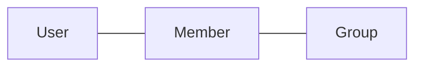
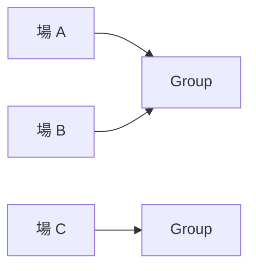
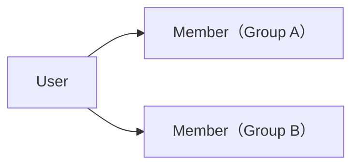

# ドメイン: グループとメンバー

グループ（お金の動きを一緒に管理する単位）と、メンバー（ある User の、ある Group における立場）を扱う。

## 概念

- `User` … mmkn を利用する人そのもの。グループをまたいで同一
- `Group` … お金の動きを管理する単位
- `Member` … ある User の、ある Group における立場

### User の属性 [確定]

| 属性 | 説明 |
|---|---|
| 同一性 | グループをまたいで変わらない、その人を指すもの |
| 名前 | mmkn 全体での名前。グループ内表示名の初期値に使う |
| ログイン識別子 | ログインしたときに行き着く、その人を指すもの。**mmkn 全体で重複しない** |

- User の名前は、どのグループにも属さない。グループ内で表示する名前は Member の表示名（後述）であり、別のもの
- 名前は **20 文字以内**。前後の空白は落とす。空にはできない [確定]。表示名の初期値に使うため、表示名（後述）と同じ上限にそろえる
- ログイン識別子は、名前とは別のもの。名前を変えても、ログインの経路は変わらない [確定]
- **ログイン識別子は、ログイン手段（後述「User と外部アカウント」）とも別のもの。** ログイン手段は複数あり、後から増やせるが、**どれで入っても行き着くログイン識別子は同じで、増やしても変わらない** [確定]。具体的に何を識別子とし、本人であることをどう確かめるかは `adr/0012-login.md` を正とする
- **User の同一性は mmkn が持つ** [確定]。Member が指す先は常に User であり、外部サービスのアカウントではない。外部サービス側で何が変わっても、User と過去の記録の結びつきは変わらない
- **本人であることを確かめる手段は、外部サービスに委ねる** [確定]。mmkn 自身は合言葉のたぐいを持たない（後述「User と外部アカウント」）

### User と外部アカウント [確定]

mmkn は複数の提供形態を持ち、そのうちいくつかは外部サービスの上で使う（`overview.md`）。**外部サービスのアカウントは、ログイン手段としてだけ現れる。**

**ログイン手段** … 本人であることを確かめる経路。**どの User の操作かは、これで決まる。**

- **User は、ログイン手段を 1 つ以上持つ** [確定]。ログイン手段を持たない User は存在しない
- **どのログイン手段で本人だと確かめられても、行き着く先は同じ User** [確定]。ログイン識別子はその User を指すもので、ログイン手段を増やしても変わらない（前述「User の属性」）
- ログイン手段は後から**追加できる**。**削除もできる。ただし最後の 1 つは削除できない** [確定]。すべて無くなると、その User に到達する経路が無くなる
- **1 つの外部アカウントは、同時に 2 人の User のログイン手段にならない** [確定]
- **1 人の User が、同じサービスのアカウントを 2 つログイン手段にすることはできない。** 1 サービスにつき 1 つ [確定]。付け替えは「削除してから追加し直す」で行う
- **ログイン手段を増やしても減らしても、過去の記録は何も壊れない** [確定]。記録が指しているのは Member であり、外部アカウントではない
- **すべてのログイン手段を失うと、その User には誰も到達できない** [確定]。mmkn は復旧手段を持たない（後述「境界・例外ケース」）。**複数持てるのは、この経路を増やして備えられるようにするためでもある**
- 外部サービス側の人の集まりと、mmkn の Group は**別のもの**。外部サービス側で同じ集まりにいることは、mmkn の Member であることを意味しない [確定]

どの外部サービスをログイン手段にできるかは `adr/0012-login.md` を正とする。

**外部サービスから届いた操作の主が誰かも、ログイン手段で解決する** [確定]。そのサービスのアカウントをログイン手段にしている User が、その操作の主になる。**それとは別に「連携」という対応を持つことはしない。**

### Group の属性 [確定]

| 属性 | 説明 |
|---|---|
| 名前 | グループの名前 |
| 既定通貨 | 金額を入力するときの初期値として使う |
| 参加コード | グループに参加するために使うコード |

- **既定通貨は、グループが扱える通貨を制限しない。** 既定通貨が JPY のグループでも、他の通貨の支払い・送金を登録できる（`domain/money.md`）
- 名前は **50 文字以内**。前後の空白は落とす。空にはできない [確定]
- 名前と既定通貨は、後から変更できる
- 参加コードはグループ作成時に生成し、**変更・再生成しない**
- 参加コードは**グループの共有リンクに埋め込んで渡す**。ユーザーが参加コードを目で読んで手で入力する経路は持たない。したがって、人が覚えたり読み上げたりできる長さである必要はない

### Group と外部サービスの場 [確定]

外部サービスには、**人が集まって会話する単位**がある。これを「場」と呼ぶ。

外部サービスから届いた操作が「どの Group に向いているか」を毎回入力させずに済ませるため、**場と Group の対応**を持つ。

- **1 つの場に対応する Group は 1 つ。** その場から届いた操作の対象は常に一意に決まる
- **1 つの Group は、複数の場に対応してよい** [確定]。同じイベントの参加者が、外部サービス上では複数の場に分かれていることがある
- 対応は後から**変更・解除できる** [確定]
- 場と Group の対応は、**参加とは無関係**。その場にいることは Member であることを意味しないし、対応づけによって Member が増えることもない
- **場を持たないクライアントもある。** 場は対象 Group を省くための手段であって、Group を指す唯一の方法ではない

### Member の属性 [確定]

| 属性 | 説明 |
|---|---|
| User | 対応する User |
| Group | 所属する Group |
| 表示名 | その Group 内で表示する名前 |

Member は User そのものではなく、**ある User の、ある Group における立場**を表す。同じ User が複数の Group に参加すれば、それぞれ別の Member になる。

- 表示名は Group ごとに設定でき、後から変更できる
- 表示名は **20 文字以内**。前後の空白は落とす。空にはできない [確定]
- Member はグループ内の順序を持たない

## ルール [確定]

- グループ作成者は自動的に Member になる
- 全 Member は同じ立場。オーナー・管理者はいない
- Member はグループから脱退できない
- Member はグループから削除できない
- Group 自体は削除できない
- Member は必ず User に対応する。User を持たない Member は存在しない

これらを持たない理由は `features.md`「mmkn が持たないもの」を正とする。

## 操作

### アカウントを作成する [確定]

- 前提条件：なし
- 入力：名前 / 外部アカウント（本人であることが確かめられた状態で受け取る）
- 起きること：
  - User を 1 つ作成する
  - 名前は入力された名前になる
  - **その外部アカウントが、最初のログイン手段になる**
- 起きないこと：
  - **1 つの外部アカウントから、2 つの User ができることはない。** 既にどれかの User のログイン手段になっているアカウントでの作成は失敗する
  - Group・Member は作られない
  - **ログイン手段は 2 つ以上にならない。** 増やすのは「ログイン手段を追加する」の責務であり、作成は 1 つだけを与える

**名前の入力欄の初期値に、外部サービス側の名前は使わない** [確定]。入力は空から始まる。

- User の名前は **mmkn 全体での名前**であり（前述「User の属性」）、外部サービス側の名前とは別のもの。初期値に借りると、その 2 つが同じものに見える
- 外部サービスから取る情報を、本人であることの確認に要る分だけに保てる。**ログイン手段を追加するときに名前を上書きしない**（後述「ログイン手段を追加する」）ことと扱いがそろう
- 代償として、**最初の 1 回だけ入力の手間が残る**。名前が必須であること・20 文字以内であることは、この決定と関係なく変わらない（前述「User の属性」）

### ログインする [確定]

- 前提条件：示された外部アカウントをログイン手段とする User が存在し、本人であることが確かめられること
- 起きること：以降の操作が、その User の操作として扱われる
- 起きないこと：
  - **User は作られない。** どの User のログイン手段でもないアカウントでログインしようとしても、新しい User はできない
  - **ログイン手段は増えない。** 増やすのは「ログイン手段を追加する」の責務
  - Group・Member・記録は一切変わらない

### ログアウトする [確定]

- 前提条件：ログインしていること
- 起きること：以降の操作が、どの User の操作でもなくなる
- 起きないこと：
  - User は消えない。**ログアウトは退会ではない**（`features.md`「mmkn が持たないもの」）
  - Group・Member・記録は一切変わらない
  - ログイン手段は、そのまま残る。次も同じように入れる

### グループを作成する [確定]

- 前提条件：なし
- 入力：グループ名 / 既定通貨 / User
- 起きること：
  - Group を作成する
  - 作成者を Member として追加する。表示名の初期値には、その User の名前を使う
  - 参加コードを生成する
- 起きないこと：
  - 作成者以外の Member は作られない
  - 作成者に、他の Member と異なる立場は与えられない

### グループ設定を変更する [確定]

- 前提条件：操作する User が、その Group の Member であること
- 入力：Group / 新しいグループ名・新しい既定通貨（変えるものだけ）
- 起きること：Group の名前・既定通貨を変更する
- 起きないこと：
  - **過去の記録は一切変わらない。** 既定通貨は入力の初期値でしかないため、既に記録された Payment / Transfer の通貨は書き換わらない
  - 参加コードは変わらない
  - 変更前の値は残らない
  - 収支・清算案は影響を受けない

### グループに参加する [確定]

- 前提条件：入力された参加コードに対応する Group が存在すること
- 入力：参加コード / User / グループ内表示名
- 起きること：Member を作成する
- 起きないこと：
  - その User が既にその Group の Member であれば、**新しい Member は作らない**。このとき、入力された表示名は反映しない [確定]。表示名を変えるのは「表示名を変更する」の責務であり、参加は何度行っても結果が変わらない
  - 既存の Member の内容は変わらない

**参加コードを持つ人には、参加する前に「グループの名前」と「Member の表示名」が見える** [確定]。どのグループに入ろうとしているかが分からないまま参加させないため。

- 見えるのはこの 2 つまでで、**記録・収支・清算案の中身は含まない**（後述「前提条件を満たさなかったとき」の「起きないこと」）
- 見ることで Member が増えることはない。参加が起きるのは上記の操作だけ
- 表示名の入力欄の初期値には、その User の名前を使う（「グループを作成する」と同じ）

### ログイン手段を追加する [確定]

- 前提条件：操作する人が、mmkn の User として既にログインしていること
- 入力：User / 追加する外部サービスのアカウント（本人であることが確かめられた状態で受け取る）
- 起きること：その外部アカウントが、その User のログイン手段になる。**以降はそれでもログインできる**
- 起きないこと：
  - 新しい User は作られない
  - Group・Member は一切変わらない。ログイン手段の追加はグループへの参加ではない
  - **ログイン識別子は変わらない** [確定]。増えたのは入口だけで、行き着く先は同じ User
  - その外部アカウントが既に別の User のログイン手段である場合、**追加は失敗し、そちらのログイン手段のままになる** [確定]。付け替えは、元の User が自分で削除してから行う。他の User の入口を奪う経路を持たない
  - その User が既に同じサービスのアカウントをログイン手段にしている場合、**追加は失敗する** [確定]。1 サービスにつき 1 つ
  - User の名前は、外部サービス側の名前で上書きされない [確定]

### ログイン手段を削除する [確定]

- 前提条件：その User に、そのサービスのログイン手段があること。**かつ、削除したあとも 1 つ以上残ること**
- 入力：User / 削除するサービス
- 起きること：その外部アカウントではログインできなくなる
- 起きないこと：
  - User は消えない
  - **最後の 1 つが消えることはない** [確定]。残りが 1 つのときの削除は失敗する
  - Group・Member・記録は一切変わらない。**過去の記録は Member を指しているため、削除しても何も壊れない**
  - その User が対応づけた「場と Group の対応」は変わらない [確定]。対応は場と Group の間のものであり、対応づけた人に紐づかない

### mmkn のアカウントを持たない人が、外部サービスから操作したとき [確定]

- 起きること：mmkn のアカウントが必要であることを、操作した本人に案内する
- 起きないこと：
  - User は作られない。**名前が要るため、操作の勢いで勝手に作られることはない**
  - Group・Member・記録は一切変わらない
  - 外部アカウントだけで、アカウントを作らずに操作が通ることはない

### 場に Group を対応づける [確定]

- 前提条件：操作する User が、その Group の Member であること
- 入力：場 / Group
- 起きること：
  - その場と Group の対応を記録する
  - その場に既に別の Group が対応していた場合、**新しい対応で置き換える**
- 起きないこと：
  - Group・Member は変わらない。対応づけは参加ではない
  - その場にいる人が Member になることはない
  - その Group に既に対応している他の場の対応は変わらない

### 場と Group の対応を解除する [確定]

- 前提条件：操作する User が、その場に対応する Group の Member であること
- 入力：場
- 起きること：その場と Group の対応を消す
- 起きないこと：
  - Group・Member・記録は一切変わらない
  - Group 自体は消えない。他の場からも、場を使わないクライアントからも、引き続き操作できる

### 対応づけられていない場から操作したとき [確定]

- 起きること：先に Group を対応づける必要があることを、操作した本人に案内する
- 起きないこと：
  - Group は作られない
  - 記録は一切変わらない
  - 対象の Group が自動的に選ばれることはない

### 表示名を変更する [確定]

- 前提条件：対象が、そのグループの Member であること
- 入力：Member / 新しい表示名
- 起きること：その Member の表示名を変更する
- 起きないこと：
  - 同じ User の、他のグループの Member の表示名は変わらない
  - 過去の記録は Member を指しているため、記録側を書き換えることはしない。過去の記録の表示にも新しい表示名が使われる [確定]。記録が「そのとき何と表示されていたか」を保持することはない

## 前提条件を満たさなかったとき [確定]

**この節は、mmkn のすべての操作に共通して効く。** `domain/record.md`・`domain/settlement.md` の各操作も、前提条件を満たさなかったときの扱いはここを正とする。

各操作の「前提条件」を満たさない場合、**操作は失敗し、データは一切変わらない。失敗した理由が操作者に伝わる。**

理由は次の 3 つを**区別して**伝える。

| 満たさなかった前提 | 伝えること |
|---|---|
| 操作する人がログインしていない | ログインが必要であること |
| 対象の Group・記録・参加コードが存在しない | 見つからないこと |
| 対象は存在するが、操作する User がその Group の Member でない | その Group の Member でないこと |

- **「存在しない」と「Member でない」を区別する** [確定]。区別することで、自分が参加したはずのグループで操作が通らないときに、原因が分かる
- **参加コードを持つ人は例外** [確定]。参加コードから引いたときに限り、グループの名前と Member の表示名が見える（前述「グループに参加する」）。参加コードは渡された人だけが持つものであり、そこに含まれるのは記録・収支・清算案の中身ではない
- 区別できる前提として、**Group を指す識別子には「他から推測できない」性質を要求する**。参加コードに求めているもの（前述「Group の属性」）と同じ。総当たりで存在を探せないため、存在の有無が分かっても実害がない
- 起きないこと：
  - 失敗した操作が、一部だけ適用されることはない
  - 前提を満たさない操作が、確認や承認を経て通ることはない
  - Member でない人に、そのグループの記録・収支・清算案の中身が見えることはない

## 用語の区別

| 用語 | 意味 | 何に使うか |
|---|---|---|
| User | mmkn を利用する人そのもの | グループをまたいだ同一性 |
| ログイン識別子 | ログインしたときに行き着く、User を指すもの | 1 User に 1 つ。名前ともログイン手段とも別のもの |
| ログイン手段 | 本人であることを確かめる経路（外部サービスのアカウント） | ログインの入口。1 User に 1 つ以上 |
| User の名前 | mmkn 全体での名前 | Member を作るときの表示名の初期値 |
| Member | ある User の、ある Group における立場 | 支払者・負担者・送り手・受け手として指す先 |
| 表示名 | その Group 内で表示する名前 | 画面に出す名前。Group ごとに独立 |
| 既定通貨 | 金額入力時の初期値 | 入力の手間を減らすだけ。扱える通貨の制限ではない |
| 登録者 | 記録を登録した User（`domain/record.md`） | 記録として持つだけ。権限には使わない |
| 外部アカウント | 外部サービス上のアカウント | User のログイン手段。本人確認と、どの User の操作かの解決に使う |
| 場 | 外部サービス上で、人が集まって会話する単位 | どの Group への操作かを解決するためだけに使う。参加とは無関係 |

## 境界・例外ケース

- 同じ User が同じグループに二重に参加しようとした場合、新しい Member を作らず、既存の Member をそのまま使う [確定]
- 2 人が同時に同じグループに参加した場合、どちらも Member になる [確定]。後から届いた方が失敗することはない
- Member が 1 人だけのグループも成立する [確定]
- 同じ表示名の Member が複数いることを許す [確定]
- 参加コードが存在しない場合、Member は作られない [確定]
- mmkn のアカウントを持たない人が、外部サービス側からグループに参加することはできない。先にアカウントを作る [確定]。**そのサービスのアカウントで作れるため、別のアカウントを用意する必要はない**
- どの場にも対応づけられていない Group が存在してよい。場を使わないクライアントからは通常どおり操作できる [確定]
- 同じ場に対して、2 人が同時に別の Group を対応づけようとした場合、**後から届いた方が勝ち、その Group が対応する** [確定]。順に届いた場合に置き換えを許している以上（上記「場に Group を対応づける」）、同時のときだけ失敗させる理由がない
  - `domain/record.md`「同じ記録に同時に手が入ったとき」とは**扱いが異なる**。あちらは編集前の内容が残らないため、黙って上書きされると消えたことに誰も気づけない。対応づけは失われるものが「どの Group を指していたか」だけで、対応づけ直せば元に戻る
- **グループ名・既定通貨・表示名を 2 人が同時に変更した場合も、後から届いた方が勝つ** [確定]。失敗させない。失われるのは「変更前の名前・通貨」だけで、入れ直せば元に戻る。上の場の対応づけと同じ理由であり、記録の変更（同上）とは事情が異なる
- 既にどれかの User のログイン手段になっている外部アカウントでアカウントを作成しようとした場合、User は作られない [確定]
- **ログイン手段を 1 つ失っても、他が残っていればその User に到達できる** [確定]。失った分は削除して、別のアカウントを追加し直せる
- **すべてのログイン手段を失った場合、その User に到達する手段は無い** [確定]。復旧の経路を持たない。Member と過去の記録はそのまま残るが、その User として操作できる人がいなくなる。**同じ人が新しくアカウントを作っても、それは別の User** であり、以前の Member を引き継がない

## 他機能との関係

- `domain/record.md` … 支払者・負担者・送り手・受け手はすべて、同じグループの Member を指す
- `domain/settlement.md` … 収支は Member ごとに導出する
- `domain/money.md` … 既定通貨の意味

## 実現方式

- 参加コードの具体的な形式と生成方法は `adr/0002-invite-code.md` を正とする。ドメインとして要求するのは「グループごとに一意」「共有リンクに埋め込める」「他のコードから推測できない」までで、文字種や長さは規定しない。[確定]
- ログイン識別子を何にし、本人であることをどう確かめるか、ログイン手段の追加をどう成立させるかは `adr/0012-login.md` を正とする。ドメインとして要求するのは次までで、どの外部サービスに委ねるか・どんな手順で確かめるかは規定しない。[確定]
  - ログイン識別子が mmkn 全体で重複せず、ログイン手段を増やしても変わらないこと
  - ログイン手段を追加・削除する本人であることが保証されること
  - 1 つの外部アカウントが、同時に 2 人の User のログイン手段にならないこと
- 上記「前提条件を満たさなかったとき」が要求する「Group を指す識別子が推測できないこと」を、識別子の生成方法としてどう満たすかは `adr/0008-layer-internals.md` を正とする。[確定]
- User の同一性をどう保持・認証するかは `adr/0003-tech-stack.md` を正とする。[確定]
