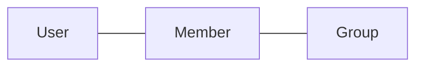
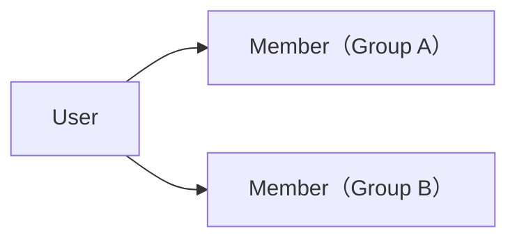

# ドメイン: グループとメンバー

グループ（お金の動きを一緒に管理する単位）と、メンバー（ある User の、ある Group における立場）を扱う。

## 概念

- `User` … mmkn を利用する人そのもの。グループをまたいで同一
- `Group` … お金の動きを管理する単位
- `Member` … ある User の、ある Group における立場

### Group の属性 [確定]

| 属性 | 説明 |
|---|---|
| 名前 | グループの名前 |
| 既定通貨 | 金額を入力するときの初期値として使う |
| 参加コード | グループに参加するために使うコード |

- **既定通貨は、グループが扱える通貨を制限しない。** 既定通貨が JPY のグループでも、他の通貨の支払い・送金を登録できる（`domain/money.md`）
- 参加コードはグループ作成時に生成し、**変更・再生成しない**

### Member の属性 [確定]

| 属性 | 説明 |
|---|---|
| User | 対応する User |
| Group | 所属する Group |
| 表示名 | その Group 内で表示する名前 |

Member は User そのものではなく、**ある User の、ある Group における立場**を表す。同じ User が複数の Group に参加すれば、それぞれ別の Member になる。

- 表示名は Group ごとに設定でき、後から変更できる
- Member はグループ内の順序を持たない

## ルール [確定]

- グループ作成者は自動的に Member になる
- 全 Member は同じ立場。オーナー・管理者はいない
- Member はグループから脱退できない
- Member はグループから削除できない
- Group 自体は削除できない
- Member は必ず User に対応する。User を持たない Member は存在しない

これらを持たない理由は `features.md`「mmkn が持たないもの」を正とする。

## 操作

### グループを作成する [確定]

- 前提条件：なし
- 入力：グループ名 / 既定通貨 / User
- 起きること：
  - Group を作成する
  - 作成者を Member として追加する。表示名の初期値には、その User の名前を使う
  - 参加コードを生成する
- 起きないこと：
  - 作成者以外の Member は作られない
  - 作成者に、他の Member と異なる立場は与えられない

### グループに参加する [確定]

- 前提条件：入力された参加コードに対応する Group が存在すること
- 入力：参加コード / User / グループ内表示名
- 起きること：Member を作成する
- 起きないこと：
  - その User が既にその Group の Member であれば、**新しい Member は作らない**。このとき、入力された表示名は反映しない [提案]
  - 既存の Member の内容は変わらない

### 表示名を変更する [確定]

- 前提条件：対象が、そのグループの Member であること
- 入力：Member / 新しい表示名
- 起きること：その Member の表示名を変更する
- 起きないこと：
  - 同じ User の、他のグループの Member の表示名は変わらない
  - 過去の記録は Member を指しているため、記録側を書き換えることはしない。過去の記録の表示にも新しい表示名が使われる [提案]

## 用語の区別

| 用語 | 意味 | 何に使うか |
|---|---|---|
| User | mmkn を利用する人そのもの | グループをまたいだ同一性 |
| Member | ある User の、ある Group における立場 | 支払者・負担者・送り手・受け手として指す先 |
| 表示名 | その Group 内で表示する名前 | 画面に出す名前。Group ごとに独立 |
| 既定通貨 | 金額入力時の初期値 | 入力の手間を減らすだけ。扱える通貨の制限ではない |
| 登録者 | 記録を登録した User（`domain/record.md`） | 記録として持つだけ。権限には使わない |

## 境界・例外ケース

- 同じ User が同じグループに二重に参加しようとした場合、新しい Member を作らず、既存の Member をそのまま使う [確定]
- Member が 1 人だけのグループも成立する [提案]
- 同じ表示名の Member が複数いることを許す [提案]
- 参加コードが存在しない場合、Member は作られない [確定]

## 他機能との関係

- `domain/record.md` … 支払者・負担者・送り手・受け手はすべて、同じグループの Member を指す
- `domain/settlement.md` … 差額は Member ごとに導出する
- `domain/money.md` … 既定通貨の意味

## 未確定 [保留]

- 参加コードの形式・桁数（`open-questions.md` #1）
- グループ名・既定通貨を後から変更できるか（`open-questions.md` #2）
- User が持つ属性。作成者の表示名の初期値に「User の名前」を使うため、User が名前を持つことが前提になっている（`open-questions.md` #3）
