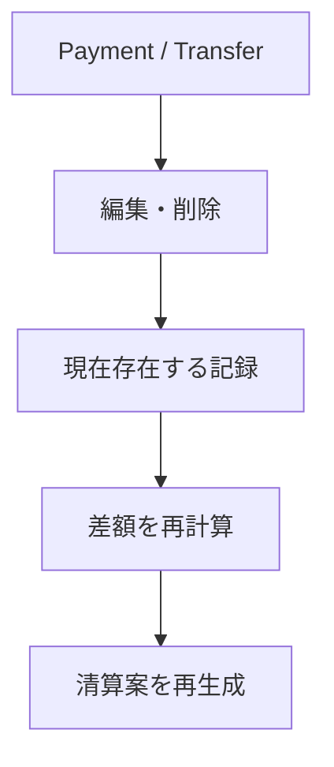

# ドメイン: 記録（支払いと送金）

mmkn が保存するお金の動きの記録を定義する。記録は **Payment（支払い）と Transfer（送金）の 2 種類だけ**。これらの記録から差額と清算案を導出する（`domain/settlement.md`）。

現実の出来事（キャンセル・返金・立替の事情など）を記録の種類として増やすことはしない。[確定] 理由は `features.md`「mmkn が持たないもの」を正とする。

## Payment（支払い）

Payment は、**グループ外に対して、ある Member が支払ったお金と、その金額を負担する Member** を記録する。[確定]

### 属性 [確定]

| 属性 | 説明 |
|---|---|
| 支払者 | 支払いを行った Member |
| 負担者 | 金額を負担する Member の集合 |
| 金額 | 正の整数（`domain/money.md`） |
| 通貨 | 金額の通貨 |
| 発生日 | 支払いが発生した日（後述「発生日」） |
| 内容 | 支払いの内容。**任意** |
| 登録者 | この Payment を登録した User |

- **内容は任意。空でもよい** [確定]。差額の計算に影響しないため、入力の手を止めさせない側を取る。空のときに一覧で何と表示するかは画面側の問題として扱う

### 支払者と負担者 [確定]

- 支払者は 1 人の Member
- 負担者は **1 人以上**の Member の集合。同じ Member を重複して含まない
- 支払者・負担者は、その Payment が属するグループの Member に限る
- **支払者と負担者は独立している。** 支払者が負担者に含まれてもよいし、含まれなくてもよい

| 例 | 可否 |
|---|---|
| 支払者 A / 負担者 A・B・C | 許す |
| 支払者 A / 負担者 B・C | 許す |
| 支払者 A / 負担者 B | 許す |
| 支払者 A / 負担者（なし） | 許さない |

### 負担額の配分 [確定]

金額は負担者に**均等に配分する**。負担額の合計は必ず金額と一致する。

割り切れない場合、余りは通貨の最小単位ごとに、負担者を並べた**先頭から 1 単位ずつ**配る。

```
10,000 JPY / 負担者 A・B・C

  基本額 = 3,333   （10,000 ÷ 3 の整数部分）
  余り   = 1

  → 先頭の A に 1 単位を加える

  A 3,334
  B 3,333
  C 3,333
```

「先頭から」の順序は、**Member が持つ変わらない同一性による決定的な順序**であり、画面上の表示順とは関係しない。同じ負担者の集合に対しては、何度計算しても常に同じ配分になる。

- 起きないこと：
  - 端数の寄せ先が、計算するたびに変わることはない
  - 負担者を入力した順番や画面上の並び順を変えても、配分は変わらない
  - 支払者であることを理由に、端数を優先して割り当てることはしない
  - 端数を配りきらずに、負担額の合計が金額と食い違うことはない

Member がグループ内の並び順を持たないことは `domain/group.md` を正とする。ここでいう順序は、ユーザーには見えない内部的な同一性のこと。

## Transfer（送金）

Transfer は、**ある Member から別の Member へのお金の移動**を記録する。それ以上の意味を持たない。[確定]

### 属性 [確定]

| 属性 | 説明 |
|---|---|
| 送り手 | お金を送った Member |
| 受け手 | お金を受け取った Member |
| 金額 | 正の整数（`domain/money.md`） |
| 通貨 | 金額の通貨 |
| 発生日 | お金が移動した日（後述「発生日」） |
| 登録者 | この Transfer を登録した User |

- Transfer は「内容」を持たない [確定]。送金そのものだけを記録し、「なぜ送ったか」を残さない（`features.md`「送金の目的」）

### ルール [確定]

- 送り手と受け手は**異なる** Member
- 送り手・受け手は、その Transfer が属するグループの Member に限る。グループ外への送金は扱わない
- 「借りの解消」「返金」「立替の返済」を区別しない
- 特定の Payment との紐付けを持たない
- 送金手段を記録しない

複数の送金は、単純に複数件の Transfer として記録する。

```
A → B 2,000 JPY
A → C 2,000 JPY
```

これは 2 件の Transfer であり、「なぜ送ったのか」をドメイン上は区別しない。

## 発生日

Payment と Transfer は、どちらも発生日を持つ。

- 発生日は日付であり、時刻を持たない [確定]
- **発生日は、入力された日付をそのまま保持する** [確定]。どの地域の日付として解釈するかという情報を持たない。海外で記録しても、入力された日付がそのまま記録され、後から読み替えられることはない
  - 入力欄の初期値に「今日」を出す場合、それは操作した本人の手元で「今日」にあたる日付を指す。**初期値であって、日付そのものの意味を決めるものではない**
- **未来の日付を指定できる** [確定]。前払いのように、これから起きる支払いを先に記録したい場面が実際にある。未来の日付であっても差額の計算は変わらず、日付が来るのを待って反映されるということもない
- 発生日は差額・清算案の計算に使わない [確定]。使うのは並び順と表示だけ

## 記録の並び [確定]

記録は、**登録された前後関係**を持つ。同じグループの 2 つの記録について、どちらが先に登録されたかは必ず決まる。

一覧に並べるときは、**発生日の新しい順**に並べる。発生日が同じ記録どうしは、**後から登録したものを先**に置く。

- Payment と Transfer をまとめて 1 つの列として扱う。種類によって分けない
- この並びは表示のためだけのもので、差額・清算案の結果には影響しない
- 上記「負担額の配分」で使う順序とは**別のもの**。あちらは Member の同一性による順序であり、記録の並びとは関係しない

## 登録者 [確定]

Payment と Transfer は、それを登録した User を記録として保持する。

登録者は、次のいずれにも**使わない**。

- 権限の判定
- 差額・清算案の計算
- 編集・削除の可否

## 記録の変更

Payment と Transfer は編集・削除できる。**グループの Member であれば、他の Member が登録した記録も編集・削除できる。** [確定]

### 編集 [確定]

- 前提条件：操作する User が、その記録の属するグループの Member であること
- 起きること：編集後の内容を、現在の記録として扱う
- 起きないこと：
  - 過去の Transfer との整合性を検査しない
  - 編集前の内容は残らない
  - 差額・清算案をその場で書き換えることはしない（次に導出するときに、新しい記録から計算される）

### 削除 [確定]

- 前提条件：操作する User が、その記録の属するグループの Member であること
- 起きること：その記録は完全に存在しなくなる
- 起きないこと：
  - 削除履歴を残さない
  - 削除した記録を復元することはできない

### 同じ記録に同時に手が入ったとき [確定]

記録は他の Member も編集・削除できるため、2 人が同じ記録を同時に変更しようとすることが起こり得る。

- 起きること：**後から届いた変更は失敗し、失敗したことが操作者に伝わる**
- 起きないこと：
  - 先に加えられた変更が、黙って上書きされることはない
  - 失敗した変更が、内容を変えて自動的にやり直されることはない
  - 編集前の内容は残らないため、失敗した側が「何が変わったか」を差分として見ることはできない [確定]

編集前の内容を残さないと決めている以上（上記「編集」）、上書きを許すと**消えたことに誰も気づけない**。したがって「黙って上書きしない」はこの決定と対になっている。

実現方式は `adr/0005-data-access-and-authorization.md` を正とする。

### 変更したあとに起きること [確定]



差額も清算案も保存していないため、記録が変われば結論は自動的に追随する。詳細は `domain/settlement.md` を正とする。

## 用語の区別

| 用語 | 意味 |
|---|---|
| Payment | グループ外への支払いと、その負担者 |
| Transfer | Member 間のお金の移動 |
| 支払者 | 実際に支払いを行った Member |
| 負担者 | その金額を負担する Member |
| 発生日 | 支払い・移動が起きた日。未来の日付も指定できる（上記「発生日」） |
| 登録者 | 記録を登録した User。何にも使わない |

どの記録が誰の差額をどちら向きに動かすかは `domain/settlement.md` を正とする。ここには再掲しない。

**支払者と登録者は別のもの。** A が支払った内容を B が入力した場合、支払者は A、登録者は B になる。

## 境界・例外ケース

- 負担者が 1 人だけの Payment を許す [確定]
- 支払者が負担者に含まれない Payment を許す [確定]
- 内容が空の Payment を許す [確定]
- 同じ内容の記録が複数あってもよい。重複として検出も統合もしない [確定]
- 記録は、登録後に別のグループへ移せない [確定]
- 発生日が未来の記録を許す。エラーにも警告にもしない [確定]
- 発生日が同じ記録が何件あっても、登録された前後関係によって並びは一意に決まる [確定]

## 他機能との関係

- `domain/group.md` … 支払者・負担者・送り手・受け手はすべて、同じグループの Member
- `domain/money.md` … 金額と通貨の表し方
- `domain/settlement.md` … 記録から差額・清算案を導出する
