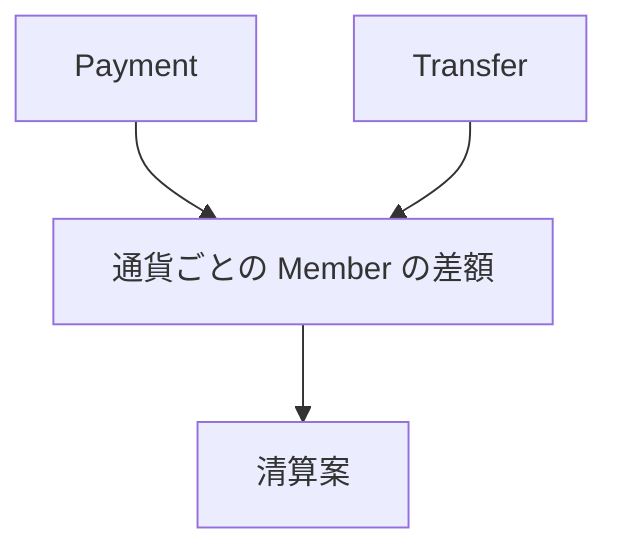
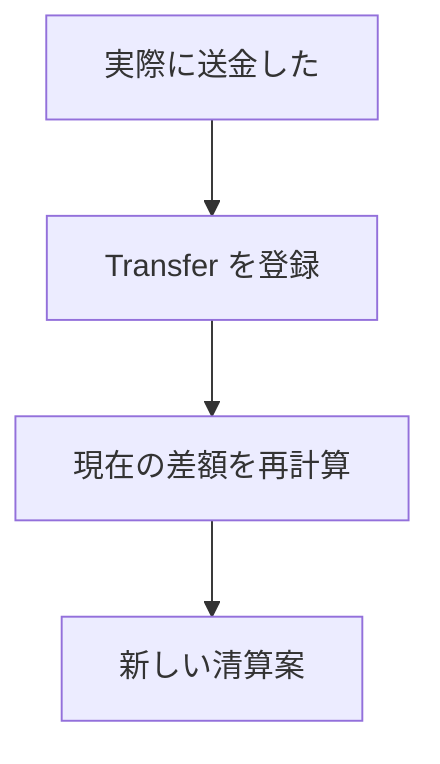

# ドメイン: 差額と清算案

保存された記録から、Member ごとの差額と清算案を導出する。**差額も清算案も保存しない。**

これが mmkn の中心にある考え方。「精算」という状態を管理するのではなく、記録されたお金の動きから、その時点で必要な送金を常に導出する。[確定]



保存するのは Payment と Transfer だけ。差額と清算案はどちらも導出値であり、記録として持たない。[確定]

## 差額 [確定]

差額は**通貨ごとに独立して**計算する（`domain/money.md`）。

### Payment が生む差額

- 支払者 … 金額の分だけ**プラス**
- 負担者 … 負担額の分だけ**マイナス**

負担額の配分ルールは `domain/record.md` を正とする。

```
A が 10,000 JPY 支払い / 負担者 A・B

  A  +10,000 − 5,000 = +5,000
  B            −5,000 = −5,000
```

### Transfer が生む差額

- 送り手 … 金額の分だけ**マイナス**
- 受け手 … 金額の分だけ**プラス**

```
A → B 2,000 JPY

  A  −2,000
  B  +2,000
```

### 差額の意味

| 差額 | 意味 |
|---|---|
| 正 | 受け取る側 |
| 負 | 支払う側 |
| 0 | 過不足なし |

### 差額の性質 [確定]

- 1 つの通貨について、グループ内の全 Member の差額を合計すると必ず 0 になる
- 差額は保存しない。導出するたびに、その時点で存在する記録から計算する

## 清算案 [確定]

清算案は、**現在の差額を 0 にするために、誰から誰へいくら送るか**を表す。

### ルール

- 通貨ごとに独立して生成する
- 現在存在する Payment / Transfer だけを考慮する
- **送金件数はできるだけ少なくするが、常に最小であることは保証しない**
- 同等な解が複数ある場合、どれを選ぶかは規定しない
- ユーザーに複数案を提示して選択させることはしない
- 清算案は計算結果であり、ユーザーがそのとおりに送金しなければならないものではない

### 起きないこと

- 清算案を確定・保存しない
- 過去の清算案は存在しない
- 「精算済み」という状態を持たない
- 清算案と Transfer を紐付けない
- 途中精算・最終精算を特別な状態として扱わない

これらを持たない理由は `features.md`「mmkn が持たないもの」を正とする。

### 送金したあとに起きること [確定]

ユーザーが実際に送金したら、単純に Transfer を登録する（`domain/record.md`）。



清算案の側では何も起きない。次に清算案を導出したとき、新しい Transfer を反映した案が生成されるだけ。

## 操作

### 差額・清算案を見る [確定]

- 前提条件：対象のグループが存在すること
- 入力：Group
- 起きること：通貨ごとの Member の差額と、通貨ごとの清算案を導出して示す
- 起きないこと：
  - データを変更しない
  - 清算案を確定・保存しない
  - 導出した結果を、次回のために残さない

## 用語の区別

| 用語 | 意味 | 保存するか |
|---|---|---|
| 差額 | 通貨ごとの、Member の過不足 | しない（導出値） |
| 清算案 | 差額を 0 にする送金の組み合わせ | しない（導出値） |
| 清算案の送金 | 清算案が示す「A から B へ n」 | しない |
| Transfer | 実際に記録されたお金の移動 | **する**（`domain/record.md`） |

**清算案の送金と Transfer は形が似ているが、別のもの。** 清算案の送金がひとりでに Transfer になることはない。ユーザーが Transfer を登録して初めて記録になり、差額に反映される。

## 境界・例外ケース

- 記録が 1 件もないグループでは、すべての差額が 0 になり、清算案は空になる [提案]
- ある通貨について全 Member の差額が 0 なら、その通貨の清算案は空になる [確定]
- 記録が存在する通貨についてのみ、差額・清算案を導出する [提案]
- ある通貨について差額が 0 でない Member が存在する場合、その通貨の清算案には必ず 1 件以上の送金が含まれる [提案]
- Member が 1 人だけのグループでは、差額の合計が 0 になる性質から、その Member の差額は常に 0 になる [提案]

## 他機能との関係

- `domain/record.md` … 差額のもとになる記録。負担額の配分ルールもここが正
- `domain/money.md` … 通貨ごとに独立して扱う理由
- `domain/group.md` … 差額は Member ごとに導出する

## 未確定 [保留]

- 送金件数を「できるだけ少なく」するための具体的な求め方。これは技術的な決定であり、確定したら ADR に記録する（`open-questions.md` #11）
